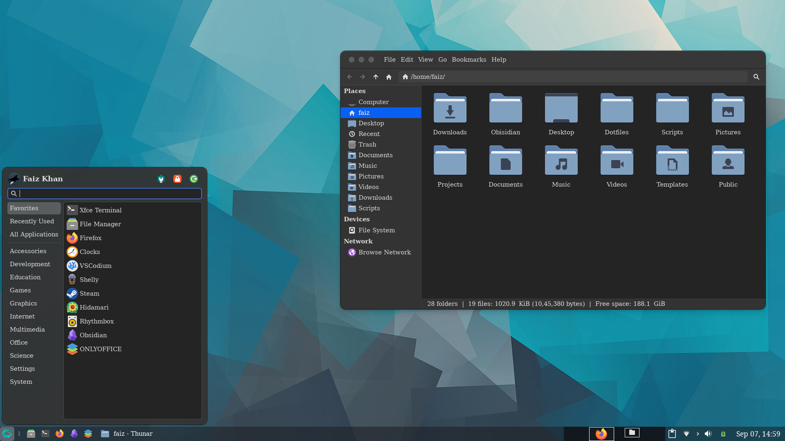
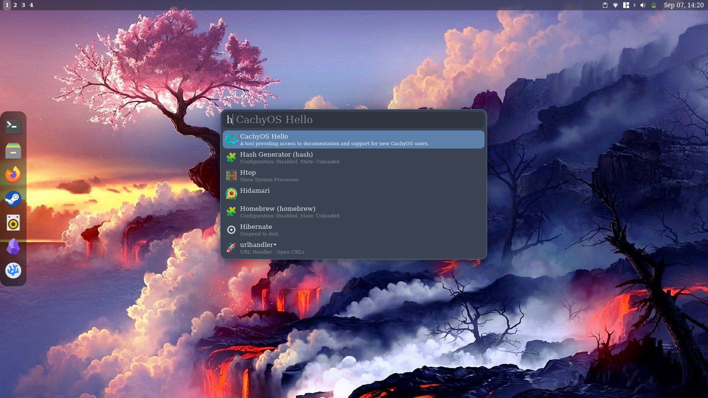
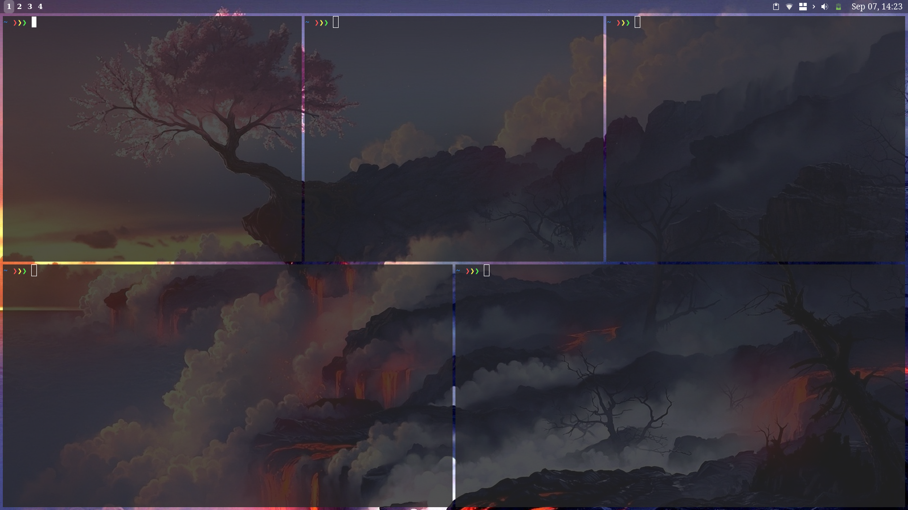

# UNDER CONSTRUCTION 🏗️ 🚧
# Xfce4-Dotfiles
Contains Two Modes :
- **Standard Mode** : Simple and easy to use layout with traditional desktop experience.
- **Power Mode** : Opinionated setup focused on aesthetics and productivity.

# Previews
- Standardized Mode


- Power Mode



# Theme
```
- Main Theme - Whitesur
- Xfwm4 Theme - Whitesur
- Icon Pack - Papirus
- Cursor - Qogir-Manjaro
- Plymouth Theme - Text
- fonts - Bitstream vera serif roman
- Plank - (Custom Config)
- Albert - Nord
```

# Apps
```
- Firefox - Whitesur || compact vertical tab
- Obsidian - Typewriter
- VS Codium - Gruvbox || Material Icon Theme
```

# Power Mode
```
Dependencies for Power Mode:
- Plank (Config Given)
- Cortile (Tiling Manager. Config Given)
- Albert (Plugin Based Launcher)
```

# Scripts
There are Two Scripts for quick toggling between Modes
- **standardize.sh** : Switches to Traditional panel. Turns off plank, albert and cortile.
- **customize.sh** : Switches to Essentialist panel. Turns on plank, albert and cortile.
